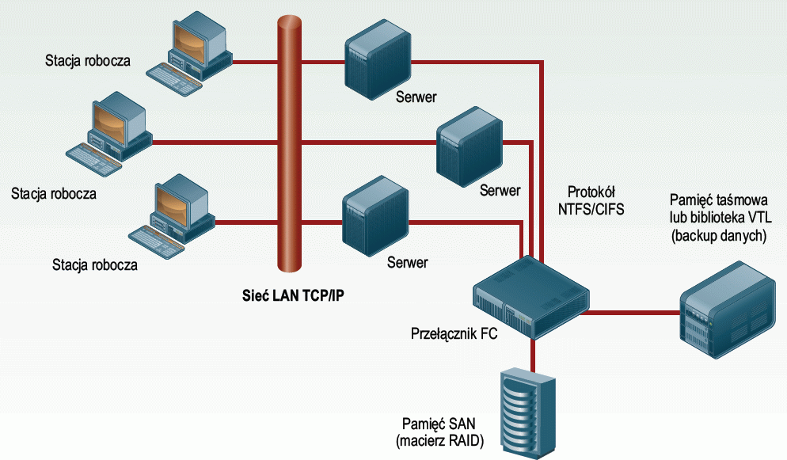
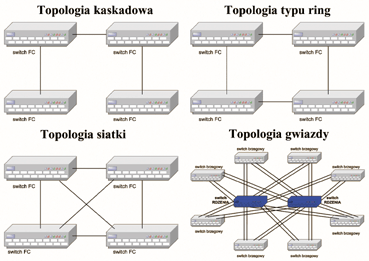
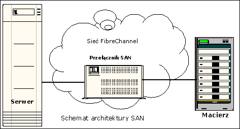

# STORAGE AREA NETWORK

## Co to jest sieć SAN
Sieć SAN (storage area network) to system połączeń, który pozwala na wydajne przesyłanie danych pomiędzy serwerami i urządzeniami pamięci masowych. Daje możliwość połączenia i współpracy pomiędzy serwerami, macierzami dyskowymi i bibliotekami taśmowymi różnych producent. Jest to najbardziej zaawansowane rozwiązanie w dziedzinie sieci pamięci masowych. Dzięki swoim zaletom znajduje zastosowanie w największych firmach, a liczba jego użytkowników stale rośnie. Dzięki centralizacji zarządzania pozwala dużym firmom na obniżenie kosztów związanych z zatrudnieniem nowych administratorów przy zwiększaniu pojemności pamięci o kolejne macierzy dyskowe oraz można uniknąć kosztów związanych z wyczerpaniem się liczby portów w macierzy lub koniecznością zakupu nowej, znacznie większej.

Sieć SAN można dziś zbudować niewielkim kosztem, wykorzystując do tego celu tani obecnie sprzęt Fibre Channel lub rozwiązania hybrydowe, łączące Fibre Channel z iSCSI, jak również w całości oparte na IP.
Przy wykorzystaniu do ich przesyłania tradycyjnych sieci komunikacyjnych LAN, które są i tak przeciążone występuje znacznie wydłużone oczekiwanie na dostęp do informacji. Wydzielenie drugiej sieci służącej wyłącznie do przesyłania danych pozwala sprostać temu wyzwaniu.
SAN charakteryzuje się bardzo długim czasem bezawaryjnej pracy systemu. Na poziomie ultra dostępnym. Oznacza to, że w skali dostępności ma 99,99999% dostępności co przekłada się na to iż w ciągu całego roku sieć maksymalnie jest niedostępna przez 3 sekundy.

## Proces projektowania infrastruktury sieci storage area network
Proces projektowania infrastruktury sieci SAN nie odbiega wiele od procesu projektowania tradycyjnej sieci LAN i złożony jest z następujących etapów:
1. zbieranie danych,
2. analiza danych,
3. wybór architektury,
4. budowa prototypu i testowanie.

### Na etapie zbierania danych projektant powinien:
* zgromadzić dokładne informacje na temat nodów, które będą włączone 
w sieć SAN,
* ustalić, które komponenty całego przedsięwzięcia już istnieją,
* ustalić w oparciu o które elementy będzie zbudowany prototyp do testowania,
* ustalić jakie dodatkowe wyposażenie będzie niezbędne do testów,
* ustalić w jaki sposób i kiedy będzie wykonywana kopia bezpieczeństwa,
* zgromadzić dokładne dane na temat bieżącej wydajności systemu,
* zgromadzić dokładne dane na temat przyszłej/wymaganej wydajności systemu,
* ustalić jaki czas niedostępności serwerów produkcyjnych (downtime) jest akceptowalny podczas implementacji nowej infrastruktury,
* ustalić jaki czas niedostępności jest akceptowalny dla konserwacji, upgrade i zmian w architekturze.
### Etap analizy danych 
polega na przełożeniu wymagań biznesowych na wymagania techniczne, dokładnej analizie zebranych danych oraz uzupełnieniu brakujących informacji. Na wyjściu tego etapu projektant powinien posiadać kompletną listę wymagań technicznych oraz analizę uzasadniającą celowość inwestycji.
### Na etapie wyboru architektury musimy znać odpowiedzi na następujące pytania:
* ile jest potrzebnych portów dla podłączenia serwerów,
* ile jest potrzebnych portów dla urządzeń pamięci masowej,
* jaka jest wymagana wydajność sieci SAN,
* gdzie (fizycznie) będzie zlokalizowane wyposażenie sieci SAN,
* jakie główne zadanie ma spełniać nowa architektura (np. konsolidacja pamięci masowej),
* jak będą się zmieniać wszystkie powyższe informacje na przestrzeni określonego czasu.
Również na tym etapie należy znaleźć kompromis pomiędzy kosztami rozwiązania a wydajnością, dostępnością i skalowalnością. Aby wybrać topologię, która najlepiej odpowiada wymaganiom postawionym na etapie zbierania danych niezbędna jest wiedza o możliwych topologiach.
## Topologie infrastruktury sieci storage area network 

### Topologia kaskadowa
Układ przełączników połączonych ze sobą, z tym, że ostatnie przełączniki nie posiadają tego połączenia. Wybór takiej topologii może być podyktowany nie wysoką ceną rozwiązania oraz łatwością implementacji. Nie należy jednak zapominać o niskiej niezawodności oraz ograniczonej skalowalności takiego rozwiązania. Największa wadą tej topologii są pojedyncze punkty awarii w postaci połączeń pomiędzy poszczególnymi przełącznikami. 
### Topologia typu ring 
Bardzo zbliżona do topologii kaskadowej. Zaletą tej topologii jest jej odporność na awarię połączeń pomiędzy przełącznikami oraz na awarię samych przełączników. Topologia typu ring wydaje się być wystarczająca w przypadku kiedy zamierzamy zbudować niewielką sieć SAN i mamy pewność, że nie będzie konieczności jej rozbudowy o kolejne przełączniki.
### Topologia siatki 
Układ przełączników, z których każdy posiada bezpośrednie połączenie z każdym. Taka topologia oferuje znaczne bezpieczeństwo i jest dobrym wyborem w przypadku gdy nie zachodzi potrzeba połączenia więcej niż czterech przełączników powyżej tej liczby inwestycja staje się nieopłacalna z uwagi na ilość portów, które są pochłaniane na połączenia pomiędzy przełącznikami. 

### Topologia gwiazdy 
Wydaje się być najrozsądniejszym wyborem oferuje najwyższe wskaźniki skalowalności, wydajności oraz dostępności a koszt takiego rozwiązania jest umiarkowany i ściśle związany z konieczną ilością portów przełączników brzegowych.
## Porównanie infrastruktury sieci storage area network z innymi systemami
Rozwiązanie SAN można stosować w przypadku, gdy chcemy zbudować infrastrukturę, w której krytycznymi parametrami są niezawodność oraz wydajność, bez ograniczeń związanych z liczbą zainstalowanych serwerów oraz pamięci masowych, z możliwością efektywnej rozbudowy.

| Parametr | DAS | NAS | FC SAN | IP SAN |
| --- | --- | ---| --- | --- | 
| Koszt dodania nowego serwera | wysoki (zakup dedykowanej pamięci masowej oraz kontrolera | niski (podłączenie serwera do sieci IP) | wysoki (zakup dedykowanej karty HBA) | niski ( podłączenie serwera do sieci IP) |
| Koszt infrastruktury | brak dedykowanej infrastruktury ( każdy serwer podłączony bezpośrednio do pamięci masowej) | niski (możliwość wykorzystania dostępnej infrastruktury IP) | Wysoki ( budowa niezależnej infrastruktury FC, przełącznik FC, karty HBA) | Niski (możliwość wykorzystania dostępnej infrastruktury IP plus dedykowany przełącznik iSCSI) |
| Wymagane umiejętności | znajomość urządzeń SCSI lub FC | znajomość mechanizmów sieci IP | znajomość mechanizmów sieci FC |  znajomość mechanizmów sieci IP |
| Zdalne współdzielenie zasobów | Brak | IP – poprzez LAN, MAN, WAN | kosztowne – z wykorzystaniem protokołów IFCP lub FCIP | IP – poprzez LAN, MAN, WAN |
| Niezawodność | Niska | Średnia | Wysoka | Wysoka |
| Wydajność | Wysoka | Niska | Wysoka | Średnia |
| Skalowalność | Niska | Średnia | Wysoka | Wysoka |

## Podział sieci infrastruktury sieci storage area network na warstwy
SAN jest specyficzną siecią, zoptymalizowaną do pełnienia jednej funkcji. Ze względu na tą specjalizację ma bardzo prostą strukturę, dzięki czemu sieć łatwo można rozbudowywać o kolejne składniki: przestrzeń dyskową lub moc obliczeniową. SAN można podzielić na trzy warstwy:
urządzenia pamięci masowej: dyski, streamery, macierze dyskowe, biblioteki optyczne, taśmowe Funkcją tych urządzeń jest dostarczenie odpowiednio dużej, skalowalnej przestrzeni dla danych;
warstwa łącza, zapewniająca odpowiednią przepustowość. Warstwa ta powinna, ze względu na konieczną niezawodność, stosować połączenia redundantne, warstwa serwerowa, zapewniająca odpowiednią moc obliczeniową. 

