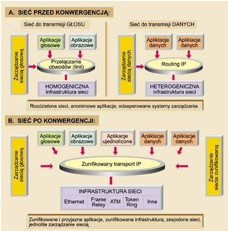

Problematyka konwergencji
----------
Zjawisko konwergencji, definiowane pierwotnie jako zbieżność (przenikanie się) pewnych trendów rozwojowych, w dziedzinie teleinformatyki jest postrzegane jako zrastanie się funkcji i technologii sieci komunikacyjnych o różnych rodowodach, wśród których dominują stosowane do tej pory prywatne sieci korporacyjne pochodzenia komputerowego (transport danych) i publiczne sieci telekomunikacyjne (przekaz głosu), dostarczające od ponad stulecia rozmówne połączenia globalne.

Coraz częściej przyjmuje się jednak, że proces konwergencji ma węższy zakres, obejmujący środowisko i technologie związane z przyszłym działaniem globalnej sieci rozszerzonego Internetu. Jedna z takich definicji określa konwergencję jako zespolenie wszystkich funkcji kanałów do transmisji głosu, obrazu, danych oraz aplikacji w jedną szerokopasmową strukturę opartą na protokole internetowym IP (Internet Protocol). Ta nowa wizja sieci internetowej ma zmienić dotychczasowe zachowania klientów przez ich trwały dostęp do ogólnoświatowych zasobów informacji i to bez ruszania się z własnego domu. W tym ujęciu sieć ta ma też stanowić precyzyjne narzędzie we współczesnym modelu ekonomicznym prowadzenia biznesu i biura, w myśl słusznej od lat zasady: "kto dysponuje właściwą informacją - ma pieniądze i władzę".

W szerszym znaczeniu zjawisko konwergencji obejmuje kojarzenie wielu dziedzin, niekoniecznie bezpośrednio związanych z telekomunikacją, takich jak: łączny przekaz informacji głosowych i danych (obraz), integracja przekazów przez sieci IP (VoIP, VoFR), współistnienie przełączania obwodów i pakietów, współdziałanie telefonu z komputerem (CTI, Call Center), integracja sieci lokalnych (LAN) z rozległymi (WAN), wzajemna migracja central PABX i routerów w sieciach inteligentnych IN, współdziałanie sieci ruchomych i stałych, oferta jednolitych usług przez sieci komórkowe i stacjonarne (standard WAP), łączenie się rynków telekomunikacyjnych z sieciowymi i in.

VoIP
----------

| Zalety | Wady |
|--|--|
| możliwość prowadzenia rozmów za darmo | brak Internetu – brak telefonii |
| mobilność numeru ( brak potrzeby zmiany numeru wraz ze zmianą siedziby/miejsca zamieszkania|  
| brak opłat abonamentowych |  |

IPTV
----------
| Zalety | Wady |
|--|--|
| nie wymaga komputera aby mieć dostęp do sieci | awaria łącza – brak dostępu do telewizji ( czasami kilkudniowy ) |
| IPTV nie korzysta z Internetu, a z wydzielonej części sieci, co jest bezpieczniejsze z punktu widzenia zagrożeń płynących z sieci | awaria łącza – brak dostępu do telewizji ( czasami kilkudniowy ) |
| do korzystania z IPTV nie jest potrzebny komputer – można z niej korzystać mając telewizor podłączony do sieci za pośrednictwem tzw. przystawki telewizyjnej, czyli set-top boxa. To samo urządzenie może stać się także dekoderem dla telewizji cyfrowej. | częste opóźnienie w stosunku do telewizji cyfrowej |
| dostęp do wielu dodatkowych usług np. gier sieciowych, skrzynki pocztowej, informacji lokalnych | opóźnienie obrazu w stosunku do głosu |
|time shifting / PVR|nie dostępny w dużej ilości miejsc|
| wideo na żądanie (VoD) |  |
| tańsze koszta niż wszystkie usługi osobno |  |

Niektóre czynniki przyspieszające konwergencję
----------

**Nowe technologie i protokoły.** Wprawdzie obecny stan technologii nie umożliwia jeszcze tworzenia w pełni konwergentnych (głos, obraz, dane) sieci szerokopasmowych, ale coraz to pojawiające się innowacje i standardy rokują ich powstanie w najbliższych 2-6 latach

**Deregulacja i liberalizacja**. Deregulacja i liberalizacja rynku telekomunikacyjnego, szczególnie widoczne w ostatnim czasie w Europie, stwarzają dobre warunki nowo powstającym firmom. Firmom, które w innej sytuacji prawdopodobnie nie mogłyby w ogóle zaistnieć na rynku telekomunikacyjnym.

**Zapotrzebowanie użytkowników.** Prawdopodobnie głównym motorem wpływającym na szybkość rozszerzania się integracji głosu z danymi będą jednak narastające wymagania użytkowników końcowych. Już teraz wielu dotychczasowych dostawców usług wywiera naciski na korporacje sieciowe (telekomy, carriers), żądając od nich łącznego przekazu głosu i danych

**Konkurencja.** Nowoczesna technologia, szybko akceptowana przez firmy dopiero co wchodzące na rynek dostawców sieciowych, pociąga za sobą automatycznie rozszerzanie procesów konwergencji w odniesieniu do głosu i danych. Nawet przy wysokim stopniu ryzyka nowe firmy - mając niewiele do stracenia, wiele natomiast do zyskania - starają się zdobyć jak najwięcej klientów, zwykle kosztem dotychczasowych telekomów.

**Redukcja kosztów.** Idea transmisji mowy w pakietach (jako danych cyfrowych) zapowiada całkowitą rewolucję przekazów głosowych. Zgodnie z nowoczesnymi algorytmami kodowania głosu przez sieci pakietowe głos można kompresować bez istotnego obniżenia jego jakości do przepływności 8 kb/s (zamiast stosowanych do tej pory 64 kb/s w sieciach PCM), a ponadto w chwilach ciszy (gdy abonent nic nie mówi) transmisja pakietów głosowych w ogóle jest zbędna.

Źródła
----------
http://mojafirma.infor.pl/e-firma/sprzet-biurowy-i-sieci/268831,Plusy-i-minusy-VoIP.html

https://pl.wikipedia.org/wiki/Internet_Protocol_Television

https://www.computerworld.pl/news/Czas-konwergencji-I,276815,1.html

